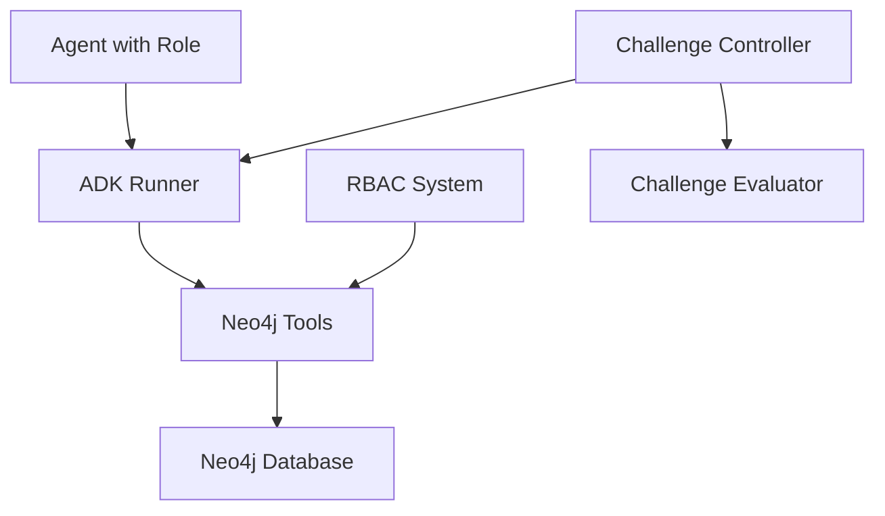
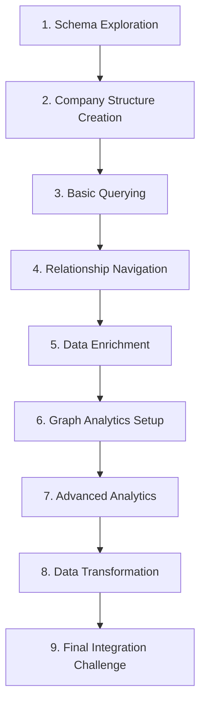

# Neo4j Gauntlet Challenge Plan

This document outlines the design for a progressive series of Neo4j database challenges that build upon each other. These challenges will serve as an evaluation for both our Neo4j tools and the agents using them.

## Overview

The "Neo4j Gauntlet" is a series of interconnected database challenges of increasing complexity. Each challenge builds upon previous ones, creating a comprehensive test of both tool capabilities and agent understanding. The gauntlet follows a narrative of building, exploring, and analyzing a fictional company's knowledge graph.

## System Architecture



## Roles and Capabilities

Based on the existing RBAC system:

| Role       | Capabilities                   | Gauntlet Focus                      |
|------------|--------------------------------|-------------------------------------|
| Explorer   | schema, read                   | Database exploration, query skills  |
| Auditor    | schema, read, gds              | Graph analytics, pattern detection  |
| Builder    | schema, read, write, gds       | Data creation, model implementation |
| Admin      | schema, read, write, gds       | Integration challenges              |

## Challenge Progression

The gauntlet consists of 9 progressive challenges that feed into one another:



## Detailed Challenge Descriptions

### Challenge 1: Schema Exploration (Explorer Role)
- **Task**: Understand the starting state of the database
- **Expected Actions**: 
  - Use SchemaTool to retrieve current schema information
  - Report on node labels, relationship types, and properties
- **Goal**: Verify tool functionality and agent's ability to interpret schema data
- **Evaluation**: Accuracy of schema reporting
- **Example Query**:
  ```cypher
  CALL db.schema.visualization()
  ```
- **Expected Output**: Initially an empty or minimal schema description

### Challenge 2: Company Structure Creation (Builder Role)
- **Task**: Create a basic company organization structure
- **Expected Actions**:
  - Create department nodes (e.g., Engineering, Marketing, Sales, HR)
  - Create employee nodes with properties (name, title, etc.)
  - Establish WORKS_IN relationships between employees and departments
  - Establish REPORTS_TO relationships between employees
- **Goal**: Test data creation capabilities
- **Evaluation**: Correctness of graph structure, use of appropriate relationships
- **Example Queries**:
  ```cypher
  CREATE (:Department {name: 'Engineering', code: 'ENG'})
  CREATE (:Department {name: 'Marketing', code: 'MKT'})
  CREATE (:Department {name: 'Sales', code: 'SLS'})
  CREATE (:Department {name: 'Human Resources', code: 'HR'})
  
  CREATE (:Employee {name: 'Alice Smith', title: 'CTO', employeeId: 'E001'})
  CREATE (:Employee {name: 'Bob Johnson', title: 'Engineering Manager', employeeId: 'E002'})
  
  MATCH (e:Employee {name: 'Bob Johnson'}), (d:Department {name: 'Engineering'})
  CREATE (e)-[:WORKS_IN]->(d)
  
  MATCH (e1:Employee {name: 'Bob Johnson'}), (e2:Employee {name: 'Alice Smith'})
  CREATE (e1)-[:REPORTS_TO]->(e2)
  ```

### Challenge 3: Basic Querying (Explorer Role)
- **Task**: Extract information from the created graph
- **Expected Actions**:
  - Count employees per department
  - Find employees with specific titles
  - List the management hierarchy
- **Goal**: Test basic query formulation and result interpretation
- **Evaluation**: Query accuracy, result interpretation
- **Example Queries**:
  ```cypher
  // Count employees per department
  MATCH (e:Employee)-[:WORKS_IN]->(d:Department)
  RETURN d.name as Department, count(e) as EmployeeCount
  ORDER BY EmployeeCount DESC
  
  // Find employees with manager titles
  MATCH (e:Employee)
  WHERE e.title CONTAINS 'Manager'
  RETURN e.name, e.title
  
  // Simple hierarchy report
  MATCH path = (e1:Employee)-[:REPORTS_TO*]->(e2:Employee)
  WHERE NOT (e2)-[:REPORTS_TO]->()
  RETURN e1.name as Employee, e2.name as ReportsTo, length(path) as Level
  ORDER BY Level
  ```

### Challenge 4: Relationship Navigation (Explorer Role)
- **Task**: Analyze the organizational structure
- **Expected Actions**:
  - Find the longest and shortest management chains
  - Identify employees who report to multiple managers
  - Find departments with the most complex reporting structures
- **Goal**: Test advanced Cypher path queries and pattern matching
- **Evaluation**: Correct use of path functions, pattern matching sophistication
- **Example Queries**:
  ```cypher
  // Find longest management chain
  MATCH path = (e:Employee)-[:REPORTS_TO*]->(manager:Employee)
  WHERE NOT (manager)-[:REPORTS_TO]->()
  RETURN e.name as Employee, manager.name as TopManager, length(path) as ChainLength
  ORDER BY ChainLength DESC
  LIMIT 1
  
  // Find employees with multiple managers
  MATCH (e:Employee)-[:REPORTS_TO]->(m:Employee)
  WITH e, count(m) as managerCount
  WHERE managerCount > 1
  RETURN e.name, managerCount
  ```

### Challenge 5: Data Enrichment (Builder Role)
- **Task**: Expand the graph with projects and skills
- **Expected Actions**:
  - Create Project nodes with properties (name, status, deadline)
  - Create Skill nodes (programming languages, tools, soft skills)
  - Connect employees to projects (WORKS_ON relationship)
  - Connect employees to skills (HAS_SKILL relationship)
  - Add skill levels as relationship properties
- **Goal**: Test complex graph expansion and property handling
- **Evaluation**: Structure correctness, relationship property usage
- **Example Queries**:
  ```cypher
  // Create projects
  CREATE (:Project {name: 'Database Migration', status: 'In Progress', deadline: '2025-06-30'})
  CREATE (:Project {name: 'Website Redesign', status: 'Planning', deadline: '2025-08-15'})
  
  // Create skills
  CREATE (:Skill {name: 'Python', category: 'Programming'})
  CREATE (:Skill {name: 'Neo4j', category: 'Database'})
  CREATE (:Skill {name: 'Project Management', category: 'Soft Skill'})
  
  // Connect employees to projects
  MATCH (e:Employee {name: 'Bob Johnson'}), (p:Project {name: 'Database Migration'})
  CREATE (e)-[:WORKS_ON {role: 'Lead Developer'}]->(p)
  
  // Connect employees to skills with proficiency
  MATCH (e:Employee {name: 'Alice Smith'}), (s:Skill {name: 'Neo4j'})
  CREATE (e)-[:HAS_SKILL {proficiency: 'Expert', yearsExperience: 5}]->(s)
  ```

### Challenge 6: Graph Analytics Setup (Auditor Role)
- **Task**: Prepare and run basic graph analytics
- **Expected Actions**:
  - Create appropriate graph projections for analytics
  - Run degree centrality to find most connected employees
  - Run betweenness centrality to find key connectors
  - Store results back in the graph
- **Goal**: Test GDS tool usage for basic analytics
- **Evaluation**: Correct GDS procedure calls, result interpretation
- **Example Queries**:
  ```cypher
  // Create a graph projection for the org structure
  CALL gds.graph.project(
    'company-graph',
    ['Employee', 'Department'],
    {
      REPORTS_TO: {orientation: 'UNDIRECTED'},
      WORKS_IN: {orientation: 'UNDIRECTED'},
      WORKS_ON: {orientation: 'UNDIRECTED'},
      HAS_SKILL: {orientation: 'UNDIRECTED'}
    }
  )
  
  // Run degree centrality
  CALL gds.degree.stream('company-graph')
  YIELD nodeId, score
  MATCH (n) WHERE id(n) = nodeId
  RETURN n.name as Name, n:Employee as IsEmployee, score as ConnectionCount
  ORDER BY ConnectionCount DESC
  LIMIT 5
  
  // Run betweenness centrality
  CALL gds.betweenness.stream('company-graph')
  YIELD nodeId, score
  MATCH (n) WHERE id(n) = nodeId
  RETURN n.name as Name, n:Employee as IsEmployee, score as BetweennessScore
  ORDER BY BetweennessScore DESC
  LIMIT 5
  
  // Write results back to graph
  CALL gds.degree.write('company-graph', {
    writeProperty: 'connectionScore'
  })
  ```

### Challenge 7: Advanced Analytics (Auditor Role)
- **Task**: Perform complex graph analysis
- **Expected Actions**:
  - Run community detection to identify natural teams
  - Compare official departments with detected communities
  - Calculate node similarity based on skills and projects
  - Identify skill gaps using graph patterns
- **Goal**: Test sophisticated analytics capabilities
- **Evaluation**: Analytics depth, insight generation
- **Example Queries**:
  ```cypher
  // Run Louvain community detection
  CALL gds.louvain.write('company-graph', {
    writeProperty: 'communityId'
  })
  
  // Compare detected communities with actual departments
  MATCH (e:Employee)-[:WORKS_IN]->(d:Department)
  RETURN d.name as Department, e.communityId as CommunityId, count(*) as EmployeeCount
  ORDER BY Department, CommunityId
  
  // Node similarity based on skills
  CALL gds.nodeSimilarity.write('company-graph', {
    writeRelationshipType: 'SIMILAR_TO',
    writeProperty: 'similarity'
  })
  
  // Skill gap analysis
  MATCH (p:Project {name: 'Database Migration'})
  MATCH (requiredSkill:Skill {name: 'Neo4j'})
  MATCH (e:Employee)-[:WORKS_ON]->(p)
  WHERE NOT (e)-[:HAS_SKILL]->(requiredSkill)
  RETURN e.name as Employee, p.name as Project, requiredSkill.name as MissingSkill
  ```

### Challenge 8: Data Transformation (Builder Role)
- **Task**: Refactor and optimize the graph based on insights
- **Expected Actions**:
  - Normalize skill names (e.g., "Python", "python", "Python 3" → "Python")
  - Create TeamLead nodes based on reporting relationships
  - Refactor project connections based on team structure
  - Add calculated metrics as node properties
- **Goal**: Test complex graph refactoring
- **Evaluation**: Transformation strategy, execution correctness
- **Example Queries**:
  ```cypher
  // Normalize skill names
  MATCH (s1:Skill), (s2:Skill)
  WHERE toLower(s1.name) = toLower(s2.name) AND id(s1) < id(s2)
  WITH s1, s2
  CALL {
    WITH s1, s2
    MATCH (e:Employee)-[r:HAS_SKILL]->(s2)
    MERGE (e)-[:HAS_SKILL {proficiency: r.proficiency}]->(s1)
    DETACH DELETE s2
  }
  
  // Create TeamLead classification
  MATCH (e:Employee)<-[:REPORTS_TO]-(subordinate:Employee)
  WITH e, count(subordinate) as directReports
  WHERE directReports >= 3
  SET e:TeamLead
  
  // Refactor project management based on team structure
  MATCH (tl:Employee:TeamLead)-[:WORKS_ON]->(p:Project)
  MATCH (tl)<-[:REPORTS_TO]-(tm:Employee)
  WHERE NOT (tm)-[:WORKS_ON]->(p)
  CREATE (tm)-[:SUPPORTS {assignedBy: tl.name}]->(p)
  ```

### Challenge 9: Final Integration Challenge (Admin Role)
- **Task**: Solve a complex business problem using all previous data
- **Expected Actions**:
  - Identify optimal project teams based on skills and connectivity
  - Detect potential bottlenecks in the organization
  - Recommend restructuring based on all available data
  - Create a comprehensive report combining all insights
- **Goal**: Test holistic graph understanding and problem-solving
- **Evaluation**: Integration of multiple techniques, solution quality
- **Example Queries**:
  ```cypher
  // Identify optimal project team for a new project
  MATCH (s:Skill)
  WHERE s.name IN ['Python', 'Neo4j', 'Project Management']
  WITH collect(s) as requiredSkills
  MATCH (e:Employee)
  WHERE all(skill IN requiredSkills WHERE (e)-[:HAS_SKILL]->(skill))
  WITH e
  MATCH (e)-[r:HAS_SKILL]->(s:Skill)
  WHERE s.name IN ['Python', 'Neo4j', 'Project Management']
  WITH e, sum(r.proficiency) as skillScore
  
  // Get connectivity metrics
  MATCH (e)
  WHERE e.connectionScore IS NOT NULL
  RETURN e.name as RecommendedTeamMember, 
         skillScore as SkillRelevance,
         e.connectionScore as TeamConnectivity,
         skillScore * e.connectionScore as OverallScore
  ORDER BY OverallScore DESC
  LIMIT 5
  ```

## Evaluation Framework

Each challenge will be evaluated on:

1. **Tool Selection**: Does the agent use the most appropriate tools?
2. **Query Construction**: How well are Cypher queries formulated?
3. **Error Handling**: How does the agent respond to errors or unexpected results?
4. **Insight Quality**: Are the agent's insights accurate and valuable?
5. **Efficiency**: Are operations performed in an optimal way?

### Challenge-Specific Evaluation Criteria

| Challenge | Primary Criteria | Secondary Criteria | Expert-Level Criteria |
|-----------|------------------|--------------------|-----------------------|
| 1. Schema Exploration | Correct tool usage | Schema interpretation | Detection of constraints/indices |
| 2. Company Structure Creation | Data model correctness | Property naming conventions | Indexing strategy |
| 3. Basic Querying | Query correctness | Result formatting | Query optimization |
| 4. Relationship Navigation | Path traversal accuracy | Recursive query patterns | Performance considerations |
| 5. Data Enrichment | Relationship modeling | Property placement | Constraint usage |
| 6. Graph Analytics Setup | GDS procedure selection | Parameter optimization | Result interpretation |
| 7. Advanced Analytics | Algorithm selection | Result visualization | Business insights |
| 8. Data Transformation | Refactoring strategy | Data consistency | Transaction usage |
| 9. Integration Challenge | Holistic approach | Solution quality | Implementation readiness |

## Implementation Details

### Code Structure for `run_gauntlet.py`

```python
# Key imports and setup (similar to run_example.py)
import asyncio
import os
from dotenv import load_dotenv
from typing import List, Dict, Any, Optional

# Import ADK components
from google.adk.agents import Agent
from google.adk.runners import Runner
from google.adk.sessions import InMemorySessionService
from google.genai import types as genai_types
from google import genai

# Import project components
from ..rbac import build_agent_tools, Role
from ..agent import initialize_neo4j_driver, shutdown_neo4j_driver

# Configuration
load_dotenv()
APP_NAME = "neo4j_adk_gauntlet"
USER_ID = "gauntlet_user"
SESSION_ID_BASE = "gauntlet_session"

# Challenge definitions
CHALLENGES = [
    {
        "id": 1,
        "name": "Schema Exploration",
        "role": "explorer",
        "description": "Explore the database schema",
        "prompt": "You're starting a new job and need to understand the company's database. What can you tell me about its current structure?",
        "expected_tools": ["schema"]
    },
    # ... define all 9 challenges
]

# Agent creation function (similar to run_example.py)
def create_agent(role: Role, model: Any) -> Agent:
    # Implementation similar to run_example.py
    pass

# Query execution function (similar to run_example.py)
async def run_query(runner: Runner, query: str, user_id: str, session_id: str) -> str:
    # Implementation similar to run_example.py
    pass

# Database reset function to ensure clean state
async def reset_database():
    # Implementation to clear all data for a fresh start
    pass

# Challenge execution function
async def run_challenge(challenge_id: int, agents: Dict[str, Agent], 
                        runners: Dict[str, Runner], 
                        results_so_far: Dict[int, Any]) -> Dict[str, Any]:
    # Implementation to run a specific challenge
    pass

# Evaluation function
def evaluate_challenge_result(challenge_id: int, result: str, 
                              db_state: Dict[str, Any]) -> Dict[str, Any]:
    # Implementation to score the challenge result
    pass

# Main gauntlet function
async def run_gauntlet(start_challenge: int = 1, end_challenge: int = 9):
    # Initialize driver
    # Create agents for all roles
    # Run challenges in sequence
    # Collect and report results
    pass

# Main execution
if __name__ == "__main__":
    try:
        asyncio.run(run_gauntlet())
    except KeyboardInterrupt:
        print("\nGauntlet run interrupted by user.")
    finally:
        # Ensure cleanup
        print("Ensuring Neo4j driver is shut down...")
```

### Error Handling Strategies

1. **Database State Verification**:
   - After each challenge, verify the database is in the expected state
   - Include helper functions to check node counts, relationship patterns, etc.
   - Roll back to previous state if needed

2. **Tool Error Handling**:
   - Record how agents handle tool errors (e.g., failed queries)
   - Test agent recovery from permission errors (e.g., when Explorer tries to write)
   - Grade agents on error message interpretation

3. **Challenge Progression**:
   - Allow running individual challenges for testing
   - Include fallback data creation if previous challenge fails
   - Support resuming from specific challenge

## Next Steps

1. Implement `run_gauntlet.py` with the complete challenge progression in Code mode
2. Create database verification functions for each challenge
3. Add detailed scoring logic for agent evaluation
4. Test with different agent configurations and LLMs
5. Extend with more advanced challenges as needed

## Implementation Timeline

1. **Phase 1**: Basic implementation of the challenge framework and first 3 challenges
2. **Phase 2**: Implementation of intermediate challenges (4-6)
3. **Phase 3**: Implementation of advanced challenges (7-9)
4. **Phase 4**: Refinement of evaluation criteria and scoring system
5. **Phase 5**: Documentation and integration with broader testing framework